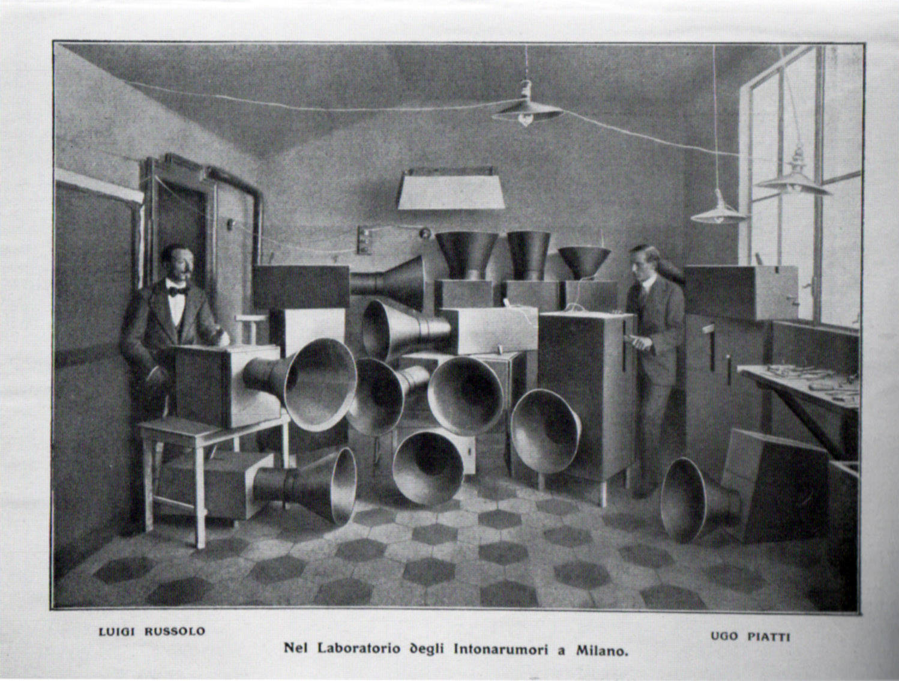
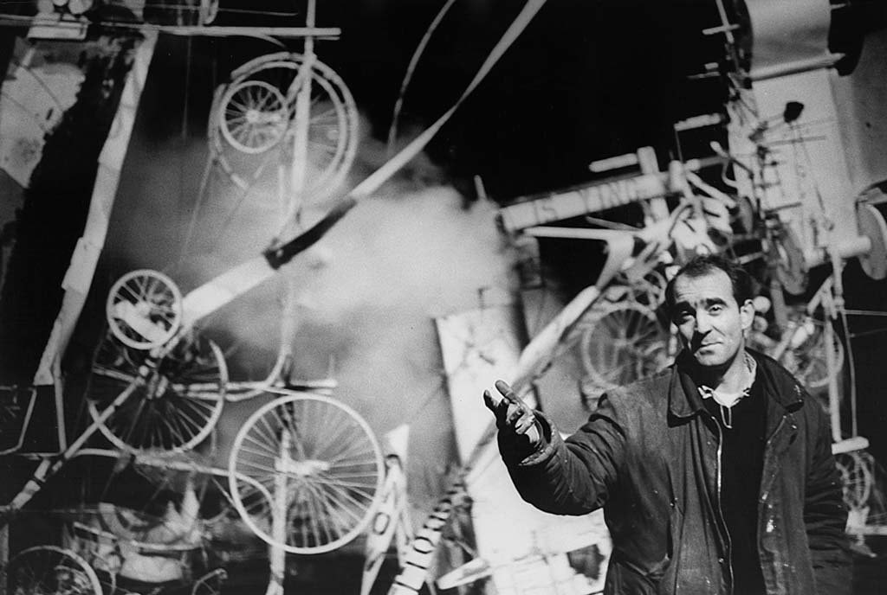

# Intonarumori

Intonarumori is a project to explore creating sounds, rhythms and music with simulated machines.

[Intonarumori](https://en.wikipedia.org/wiki/Intonarumori) is the name of the experimental musical instruments invented and built by the Italian futurist artist [Luigi Russolo](https://en.wikipedia.org/wiki/Luigi_Russolo) in the early twentieth century.

<table>
  <tr>
  <td>
    
  </td>
  <td>
    
  </td>
  </tr>
  <tr>
  <td>
    Luigi Russolo (left) in his laboratory.
  </td>
  <td>
    Jean Tinguely
  </td>
  </tr>
</table>

This project takes inspiration from Russolo and his Intonarumori, as well as from [Jean Tinguely](https://en.wikipedia.org/wiki/Jean_Tinguely), an artist known for his kinetic art sculptures. Machinelike artworks that he called 'metamachines' that often produce repetitive noises and sounds.

In this project the aim is to create virtual machines that run in a web browser. They generate their sounds through the computer's speaker and are operated by mouse click, a device's touch screen or externally via MIDI signals.

## Kodaly Kibo

For MIDI control the machines are especially designed to work with the [Kodaly Kibo](https://www.kodaly.app/). The Kibo is a MIDI controller with eight wooden shapes that can be played like drum pads or piano keys. MIDI transmits wireless over Bluetooth LE or over USB cable.

Only common MIDI messages are used however, so other MIDI controllers can be used as well.

## Machine #1

  

Demo online here: [https://www.hisschemoller.com/intonarumori/1/](https://www.hisschemoller.com/intonarumori/1/)

Machine 1 has eight spinning wheels with protrusions that hit free floating sticks. When hit they trigger eight different sounds. Each wheel spins at it's own speed. This creates interesting continually changing patterns.

### Control panel

The 'sliders' icon at the top toggles the control panel that appears at the bottom of the screen.

The speed of each wheel can be set individually by eight sliders in the control panel, or by incoming MIDI continuous controllers 1 to 8 on any MIDI channel.

The toggle buttons below the sliders switch the wheels on and off.

One of several types of sounds can be selected from a list.

### MIDI implementation
# Intonarumori

Intonarumori is a project to explore creating sounds, rhythms and music with simulated machines.

[Intonarumori](https://en.wikipedia.org/wiki/Intonarumori) is the name of the experimental musical instruments invented and built by the Italian futurist artist [Luigi Russolo](https://en.wikipedia.org/wiki/Luigi_Russolo) in the early twentieth century.

<table>
  <tr>
  <td>
    
  </td>
  <td>
    
  </td>
  </tr>
  <tr>
  <td>
    Luigi Russolo (left) in his laboratory.
  </td>
  <td>
    Jean Tinguely
  </td>
  </tr>
</table>

This project takes inspiration from Russolo and his Intonarumori, as well as from [Jean Tinguely](https://en.wikipedia.org/wiki/Jean_Tinguely), an artist known for his kinetic art sculptures. Machinelike artworks that he called 'metamachines' that often produce repetitive noises and sounds.

In this project the aim is to create virtual machines that run in a web browser. They generate their sounds through the computer's speaker and are operated by mouse click, a device's touch screen or externally via MIDI signals.

## Kodaly Kibo

For MIDI control the machines are especially designed to work with the [Kodaly Kibo](https://www.kodaly.app/). The Kibo is a MIDI controller with eight wooden shapes that can be played like drum pads or piano keys. MIDI transmits wireless over Bluetooth LE or over USB cable.

Only common MIDI messages are used however, so other MIDI controllers can be used as well.

## Machine #1

  

Demo online here: [https://www.hisschemoller.com/intonarumori/1/](https://www.hisschemoller.com/intonarumori/1/)

Machine 1 has eight spinning wheels with protrusions that hit free floating sticks. When hit they trigger eight different sounds. Each wheel spins at it's own speed. This creates interesting continually changing patterns.

### Control panel

The 'sliders' icon at the top toggles the control panel that appears at the bottom of the screen.

The speed of each wheel can be set individually by eight sliders in the control panel, or by incoming MIDI continuous controllers 1 to 8 on any MIDI channel.

The toggle buttons below the sliders switch the wheels on and off.

One of several types of sounds can be selected from a list.

### MIDI implementation

On any MIDI channel:

- CC 1 to 8 - Rotation speed of the eight wheels.
  - Value 0 stops the wheel.
  - Values 1 to 127 set the speed increasingly higher.
- Program Change + Note On with pitch 60, 62, 64, 65, 67, 69, 71 or 72 - Rotation speed
  - This sets the speed just like CC 1 to 8, but this combination is especially added for the Kibo controller: Press pads on the Kibo (so that a Note On for those pads is sent), then turn the Kibo's knob (Program Change) to adjust the speed of the wheels.
- CC 102 TO 109 - On / Off toggle for each wheel, where:
  - Value 127 switches the wheel on.
  - Values 126 and below switch the wheel off.
- CC 119 - Sound selection.
  - Each received value 127 toggles one further through the list of sounds. This option isespecially added for the Kibo controller: Click the knob to select the next sound in the list.

## Code

This project is written in [TypeScript](https://www.typescriptlang.org/). It's built on the [Vue 3](https://v3.vuejs.org/) framework with [VueX](https://vuex.vuejs.org/) and the [PrimeVUE](https://www.primefaces.org/primevue/) components library. The machines are made with [three.js](https://threejs.org/) and the [ammo.js](https://github.com/kripken/ammo.js/) physics engine.

On any MIDI channel:

- CC 1 to 8 - Rotation speed of the eight wheels.
  - Value 0 stops the wheel.
  - Values 1 to 127 set the speed increasingly higher.
- Program Change + Note On with pitch 60, 62, 64, 65, 67, 69, 71 or 72 - Rotation speed
  - This sets the speed just like CC 1 to 8, but this combination is especially added for the Kibo controller: Press pads on the Kibo (so that a Note On for those pads is sent), then turn the Kibo's knob (Program Change) to adjust the speed of the wheels.
- CC 102 TO 109 - On / Off toggle for each wheel, where:
  - Value 127 switches the wheel on.
  - Values 126 and below switch the wheel off.
- CC 119 - Sound selection.
  - Each received value 127 toggles one further through the list of sounds. This option isespecially added for the Kibo controller: Click the knob to select the next sound in the list.

## Code

This project is written in [TypeScript](https://www.typescriptlang.org/). It's built on the [Vue 3](https://v3.vuejs.org/) framework with [VueX](https://vuex.vuejs.org/) and the [PrimeVUE](https://www.primefaces.org/primevue/) components library. The machines are made with [three.js](https://threejs.org/) and the [ammo.js](https://github.com/kripken/ammo.js/) physics engine.
